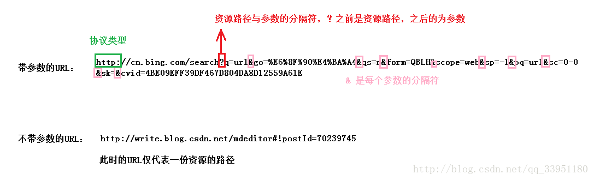
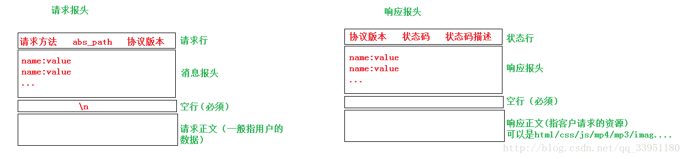

## MIX_webserver

http 服务端，即 Web 服务端。基于 http 协议，将网页对应文件传输给客户端的服务器端。

### http 协议

http 是一种无状态的协议，服务端响应客户端请求后立即断开连接。换言之，服务端不会维持客户端状态。即使同一客户端再次发送请求，服务端也无法辨认出事原先那个，而会咦相同方式处理新请求。为了弥补 http 无法保持连接的缺点，Web 编程种通常会使用 Cookie 和 Session 技术。

Web 服务器的消息请求方式：分为 GET，POST 两种请求方式，GET 方式请求数据方便。可以直接在 URL 地址处传递数据，因为它没有消息体，需要传输的数据参数只能通过 url 地址传递，这样不安全。而 POST 则可以插入消息体，所以客户端想服务端传递数据时可以通过这个消息体传递，不必写在 url 处，这样更安全，也方便传输哒数据。

http 请求消息的结构：包括请求行，消息头，空行，消息体。请求行只能通过一行发送，如： “ GET/index.html http/1.1 "，就是咦 GET 方式请求 index.html 文件，希望以 1.1 版本的 http 协议进行通信。消息头一般包括浏览器信息，用户认证等附加信息。而消息头和消息体之间需要以空行分开，防止边界问题，消息体种装有客户端想服务端传输的数据，只有 POST 方式才有消息体（客户端向服务端发送请求的数据包结构）

http 响应消息的结构：包括状态行，消息头，空行，消息体。状态行包含客户端请求的处理结果，如 ” HTTP/1.1 200 OK " 我用 http 1.1 的版本进行响应，你的请求已正确处理（200 OK），典型的数字状态码有：200 OK 表示成功处理了请求，404 Not Found 表示请求的文件不存在，400 Bad Request 表示请求方式错误，请检查。500 Internal Server Error 通用错误消息，服务器遇到了一个未曾预料的状况，导致了它无法完成对请求的处理。没有给出具体错误消息。

### http 服务器实现的基本框架

#### 关于 http 协议

即超文本传输协议，是互联网上应用最广泛的网络协议。它是应用层的协议，底层是基于 TCP 通信的。HTTP 协议的工作过程：客户通过浏览器向服务器发送文档请求，浏览器将请求的资源回应给浏览器，然后关闭连接。即：连接->请求->响应->关闭连接。

#### 关于 url

统一资源定位符，每个网页都对应一个 URL 地址（俗称网址），具有全球唯一性。它包含的信息指出文件的位置以及浏览器应该怎么处理它。一个完整的 URL 包括协议类型，主机类型，路径和文件名。http 协议的 url 格式：http://host [:port] [abs_path]，http 表示使用 http 协议来进行资源定位；host 时主机域名；port 是端口号，一般有默认的；abs_path 代表资源的路径。

有带参数的 url 和不带参数的 url

GET 方法使用的是带参数的 URL，即传递的参数会使用 ？连接在资源路径的后边；POST 方法使用的是不带参数的URL，它的参数是通过 http 请求报头中的请求消息体传递给服务器的。

#### 关于HTTP的请求与响应格式

响应报头中的状态码和状态码描述，例如：当请求的资源不存在时，会收到“404 NotFound”的页面，404就是状态码，“NotFound”就是状态码描述，即请求的文件不存在。

## 开发环境

ubuntu 16

gcc 

cmake

## 项目路径

bin -- 二进制

build -- 中间文件路径

cmake -- cmake 函数

CMakelists.txt -- cmake 定义文件

lib -- 库的输出路径

mix -- 源代码路径

tests -- 测试代码路径

## 日志系统

仿照 Log4J

## 协程库封装

## socket 函数库

## http 协议开发

## 分布协议

## 推荐系统