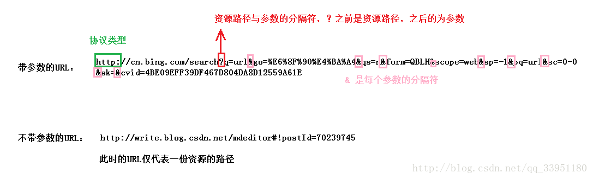
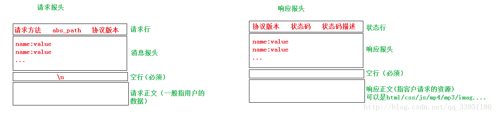

## 1 http 协议

http 是一种无状态的协议，服务端响应客户端请求后立即断开连接。换言之，服务端不会维持客户端状态。即使同一客户端再次发送请求，服务端也无法辨认出事原先那个，而会咦相同方式处理新请求。为了弥补 http 无法保持连接的缺点，Web 编程种通常会[使用 Cookie 和 Session 技术](https://blog.csdn.net/qq_27656675/article/details/69787829)。

Web 服务器的消息请求方式：分为 GET，POST 两种请求方式，GET 方式请求数据方便。可以直接在 URL 地址处传递数据，因为它没有消息体，需要传输的数据参数只能通过 url 地址传递，这样不安全。而 POST 则可以插入消息体，所以客户端想服务端传递数据时可以通过这个消息体传递，不必写在 url 处，这样更安全，也方便传输大一点的数据。

http 请求消息的结构：包括请求行，消息头，空行，消息体。请求行只能通过一行发送，如： “ GET/index.html http/1.1 "，就是以 GET 方式请求 index.html 文件，希望以 1.1 版本的 http 协议进行通信。消息头一般包括浏览器信息，用户认证等附加信息。而消息头和消息体之间需要以空行分开，防止边界问题，消息体种装有客户端想服务端传输的数据，只有 POST 方式才有消息体（客户端向服务端发送请求的数据包结构）

http 响应消息的结构：包括状态行，消息头，空行，消息体。状态行包含客户端请求的处理结果，如 ” HTTP/1.1 200 OK " 我用 http 1.1 的版本进行响应，你的请求已正确处理（200 OK），典型的数字状态码有：200 OK 表示成功处理了请求，404 Not Found 表示请求的文件不存在，400 Bad Request 表示请求方式错误，请检查。500 Internal Server Error 通用错误消息，服务器遇到了一个未曾预料的状况，导致了它无法完成对请求的处理。没有给出具体错误消息。

## 2 http 服务器实现的基本框架

### 2.1 关于 http 协议

即超文本传输协议，是互联网上应用最广泛的网络协议。它是应用层的协议，底层是基于 TCP 通信的。HTTP 协议的工作过程：客户通过浏览器向服务器发送文档请求，浏览器将请求的资源回应给浏览器，然后关闭连接。即：连接->请求->响应->关闭连接。

### 2.2 关于 url

统一资源定位符，每个网页都对应一个 URL 地址（俗称网址），具有全球唯一性。它包含的信息指出文件的位置以及浏览器应该怎么处理它。一个完整的 URL 包括协议类型，主机类型，路径和文件名。http 协议的 url 格式：http://host [:port] [abs_path]，http 表示使用 http 协议来进行资源定位；host 是主机域名；port 是端口号，一般有默认的；abs_path 代表资源的路径。

有带参数的 url 和不带参数的 url



GET 方法使用的是带参数的 URL，即传递的参数会使用 ？连接在资源路径的后边；POST 方法使用的是不带参数的URL，它的参数是通过 http 请求报头中的请求消息体传递给服务器的。

### 2.3 关于HTTP的请求与响应格式



HTTP请求报文由请求行（request line）、请求头部（header）、空行和请求数据四个部分组成。

其中，请求分为两种，GET和POST，具体的：

-   **GET**

```http
     GET /562f25980001b1b106000338.jpg HTTP/1.1
     Host:img.mukewang.com
     User-Agent:Mozilla/5.0 (Windows NT 10.0; WOW64)
     AppleWebKit/537.36 (KHTML, like Gecko) Chrome/51.0.2704.106 Safari/537.36
     Accept:image/webp,image/*,*/*;q=0.8
     Referer:http://www.imooc.com/
     Accept-Encoding:gzip, deflate, sdch
     Accept-Language:zh-CN,zh;q=0.8
     空行
    请求数据为空
```

-   **POST**

```http
    POST / HTTP1.1
    Host:www.wrox.com
    User-Agent:Mozilla/4.0 (compatible; MSIE 6.0; Windows NT 5.1; SV1; .NET CLR 2.0.50727; .NET CLR 3.0.04506.648; .NET CLR 3.5.21022)
    Content-Type:application/x-www-form-urlencoded
    Content-Length:40
    Connection: Keep-Alive
    空行
    name=Professional%20Ajax&publisher=Wiley
```

>   -   **请求行**，用来说明请求类型,要访问的资源以及所使用的HTTP版本。
>       GET说明请求类型为GET，/562f25980001b1b106000338.jpg(URL)为要访问的资源，该行的最后一部分说明使用的是HTTP1.1版本。
>
>   -   **请求头部**，紧接着请求行（即第一行）之后的部分，用来说明服务器要使用的附加信息。
>
>   -   -   HOST，给出请求资源所在服务器的域名。
>       -   User-Agent，HTTP客户端程序的信息，该信息由你发出请求使用的浏览器来定义,并且在每个请求中自动发送等。
>       -   Accept，说明用户代理可处理的媒体类型。
>       -   Accept-Encoding，说明用户代理支持的内容编码。
>       -   Accept-Language，说明用户代理能够处理的自然语言集。
>       -   Content-Type，说明实现主体的媒体类型。
>       -   Content-Length，说明实现主体的大小。
>       -   Connection，连接管理，可以是Keep-Alive或close。
>
>   -   **空行**，请求头部后面的空行是必须的即使第四部分的请求数据为空，也必须有空行。
>
>   -   **请求数据**也叫主体，可以添加任意的其他数据。

#### **响应报文**

HTTP响应也由四个部分组成，分别是：状态行、消息报头、空行和响应正文。

```http
 HTTP/1.1 200 OK
 Date: Fri, 22 May 2009 06:07:21 GMT
 Content-Type: text/html; charset=UTF-8
 空行
 <html>
       <head></head>
       <body>
             <!--body goes here-->
       </body>
</html>
```

>   -   状态行，由HTTP协议版本号， 状态码， 状态消息 三部分组成。
>       第一行为状态行，（HTTP/1.1）表明HTTP版本为1.1版本，状态码为200，状态消息为OK。
>   -   消息报头，用来说明客户端要使用的一些附加信息。
>       第二行和第三行为消息报头，Date:生成响应的日期和时间；Content-Type:指定了MIME类型的HTML(text/html),编码类型是UTF-8。
>   -   空行，消息报头后面的空行是必须的。
>   -   响应正文，服务器返回给客户端的文本信息。空行后面的html部分为响应正文。

### HTTP状态码

HTTP有5种类型的状态码，具体的：

-   1xx：指示信息--表示请求已接收，继续处理。

-   2xx：成功--表示请求正常处理完毕。

-   -   200 OK：客户端请求被正常处理。
    -   206 Partial content：客户端进行了范围请求。

-   3xx：重定向--要完成请求必须进行更进一步的操作。

-   -   301 Moved Permanently：永久重定向，该资源已被永久移动到新位置，将来任何对该资源的访问都要使用本响应返回的若干个URI之一。
    -   302 Found：临时重定向，请求的资源现在临时从不同的URI中获得。

-   4xx：客户端错误--请求有语法错误，服务器无法处理请求。

-   -   400 Bad Request：请求报文存在语法错误。
    -   403 Forbidden：请求被服务器拒绝。
    -   404 Not Found：请求不存在，服务器上找不到请求的资源。

-   5xx：服务器端错误--服务器处理请求出错。

-   -   500 Internal Server Error：服务器在执行请求时出现错误。

http 处理流程

http 报文处理流程

-   浏览器端发出 http 连接请求，主线程创建 http 对象接收请求并将所有数据读入对应 buffer，将该对象插入任务队列，工作队列从任务队列中取出一个任务进行处理。
-   工作线程取出任务后，调用 ProcessRead 函数，通过主从状态机对请求报文进行解析。
-   解析完后，跳转到 DoRequest 函数生成响应报文，通过 ProcessWrite 写入 buffer，返回给浏览器端。

