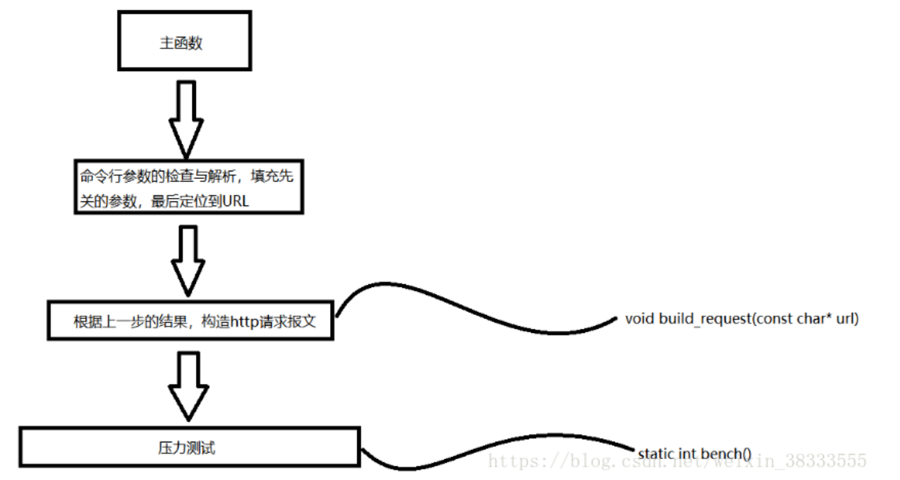

压力测试相关

webbench 实现。最多可以模拟 3w 左右的并发请求，可以控制时间，是否使用缓存，是否等待服务器回复等。

其核心原理是：父进程 fork 若干个子进程，每个子进程在用户要求时间或默认的时间内对目标 web 循环发出实际访问请求，父子进程通过管道进行通信，子进程通过管道写端向父进程传递在若干次请求访问完毕后记录到的总信息，父进程通过管道读端读取子进程发来的相关信息，子进程在时间到后结束，父进程在所有子进程退出后统计并给用户显示最后的测试结果，然后退出。

详细实现过程

主函数思路如下：

命令行参数解析

通过 getopt_long 库函数。

构造 http 请求报文

压力测试

