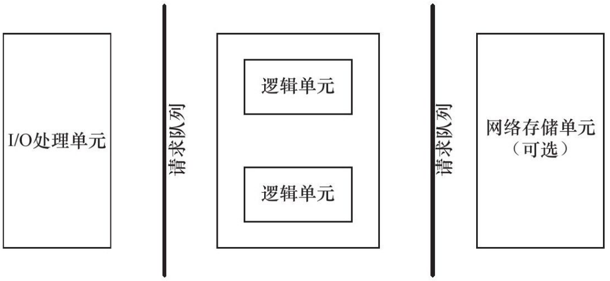

##  1 项目介绍

做这个项目的目的，项目的大致内容，项目实现的效果，最后，具体讲一下项目的各个模块与功能实现吧。

这是一个练习项目，写这个项目的主要目的是练习 Linux 环境下的网络编程和系统编程。同时通过项目学习 C++ 的语言特性。这个项目里面用到的网络编程主要分为两大块，分别是 socket 相关的系统调用和 io 复用相关的系统调用。系统编程主要是通过多线程相关的系统调用实现了处理用户请求和管理建立用户连接所用到的线程池和数据库连接池。项目的效果是，在使用线程池 + 非阻塞 socket + epoll 事件触发 + Reactor 事件处理的并发模型下，可以实现上万的并发连接数据交换。同时，项目也实现了一个 http 状态机用来解析 http 请求，可以通过服务端的数据库实现用户的注册，登录功能。可以请求服务器图片和视频文件。实现了一个异步日志系统，实时记录服务器运行状态。

然后是项目的模块。模块设计基于 c/s 模型。 并遵循基本的服务器编程框架。框架如下：

首先是最前面的 I/O 处理单元，是服务器管理客户连接的模块。它用来等待并接受新的客户连接，接收客户数据，将服务器的响应数据返回给客户端。对于一个服务器机群来说，I/O 处理单元是一个专门的接入服务器。它同时要实现负载均衡，从所有的逻辑服务器中选取负荷最小的一台来为客户服务。

I/O 处理单元之后就是逻辑单元。逻辑单元之后是网络存储单元。各单元之间的通信方式可以抽象成为一个请求队列。I/O 处理单元接收到客户请求时，需要以某种方式通知一个逻辑单元来处理该请求。同样，多个逻辑单元同时访问一个存储单元时，也需要采用某种机制来保障线程安全。**请求队列通常被实现为池的一部分**，对于一个服务器机群来讲，请求队列时各台服务器之间预先建立的，静态的，永久的 TCP 连接。

顾名思义，逻辑单元用来处理并分析客户数据，然后将结果传递给 I/O 处理单元，然后发送给客户端。对于一个服务器机群来讲，一个逻辑单元可能就是一个逻辑服务器，多个逻辑服务器并行地处理客户任务。网络存储单元可以是数据库，缓冲或者文件。也可以表现为具体的存储服务器，据我了解，数存这边很多的客户就是拿华为的产品来做存储服务器的。因为很多的用户信息需要保存在存储单元中。必须使用高性能的服务器才能办到。

我的这个项目也是在这个编程框架上构建的，首先是 I/O 处理单元的设计。作为一个 web 服务器，用户的连接请求是随机到达的，而且有可能在同一时刻有多个用户请求到达。我通过非阻塞 socket 技术并通过 epoll IO 复用实现了对 监听 socket listenfd 和连接 socket（客户请求连接之后的 socket）的同时监听。I/O 复用也就是 epoll 通过系统内核监听多个文件描述符，它本身是阻塞的，在一次 epoll_wait 过程中，返回监听到的时间数量。然后我们通过监听事件发生的文件描述符去处理事件。为了提高效率，这部分通过线程池来实现并发。为每个就绪的文件描述符来分配一个逻辑单元也就是线程来处理。

将就绪事件取出后，进入逻辑处理单元。对事件中的文件描述符进行一个判断，如果是监听事件，就接受客户端连接。如果是读写事件，就用线程池处理。如果是超时，则用定时器处理非活动连接。

## 2 项目中的重点和难点

#### **线程池相关**

-   手写线程池
-   线程的同步机制有哪些？
-   线程池中的工作线程是一直等待吗？
-   你的线程池工作线程处理完一个任务后的状态是什么？
-   如果同时1000个客户端进行访问请求，线程数不多，怎么能及时响应处理每一个呢？
-   如果一个客户请求需要占用线程很久的时间，会不会影响接下来的客户请求呢，有什么好的策略呢?

#### **并发模型相关**

-   简单说一下服务器使用的并发模型？
-   reactor、proactor、主从reactor模型的区别？
-   reactor 模式：要求主线程（i/o 处理单元）只负责监听文件描述符上是否有事件发生，若有，则立即通知工作线程，将 socket 上可读可写事件放入请求队列，读写数据，接受新连接，和处理客户请求均在工作线程中完成（需要区别读和写事件）
-   你用了epoll，说一下为什么用epoll，还有其他复用方式吗？区别是什么？
-   epoll 是 linux 特有的 i/o 复用函数，通过创建一个 epoll 事件描述符，然后通过 epoll_ctl 函数在 epoll_fd 上添加，修改或者删除事件。事件类型有 epoll_event 结构体类型。然后沟通过  epoll_wait 函数在一段时间内等待这组文件描述符上发生的事件，并返回就绪的文件描述符的个数。同时从内核事件表中复制到第二个参数 events 指向的数组中。这个数组就是输出的 epoll_wait 检测到的就绪事件。

#### **HTTP报文解析相关**

-   用了状态机啊，为什么要用状态机？
-   状态机的转移图画一下
-   https协议为什么安全？
-   https的ssl连接过程
-   GET和POST的区别

#### **数据库登录注册相关**

-   登录说一下？
-   你这个保存状态了吗？如果要保存，你会怎么做？（cookie和session）
-   登录中的用户名和密码你是load到本地，然后使用map匹配的，如果有10亿数据，即使load到本地后hash，也是很耗时的，你要怎么优化？
-   用的mysql啊，redis了解吗？用过吗？

#### **定时器相关**

-   为什么要用定时器？
-   说一下定时器的工作原理
-   双向链表啊，删除和添加的时间复杂度说一下？还可以优化吗？
-   最小堆优化？说一下时间复杂度和工作原理

#### **日志相关**

-   说下你的日志系统的运行机制？
-   为什么要异步？和同步的区别是什么？
-   现在你要监控一台服务器的状态，输出监控日志，请问如何将该日志分发到不同的机器上？（消息队列）

#### **压测相关**

-   服务器并发量测试过吗？怎么测试的？
-   webbench是什么？介绍一下原理
-   测试的时候有没有遇到问题？

#### **综合能力**

-   你的项目解决了哪些其他同类项目没有解决的问题？
-   说一下前端发送请求后，服务器处理的过程，中间涉及哪些协议？

手写阻塞队列

GET 和 POST 的区别：https://www.cnblogs.com/logsharing/p/8448446.html

https://zhuanlan.zhihu.com/p/364044293，项目讲解

内存池：https://blog.csdn.net/qq_36631379/article/details/108822460， https://zhuanlan.zhihu.com/p/64719710

http://mysql.taobao.org/monthly/2018/09/01/

### 语言特性相关

单例模式：

除了单例模式之外还有哪些设计模式：

## 3 项目中的遇到的问题以及解决方案

