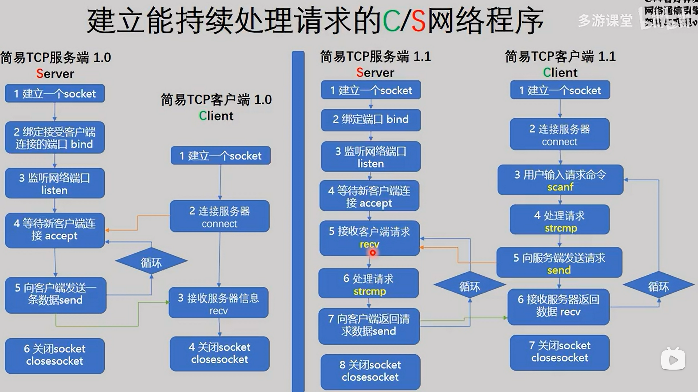

# 高并发服务器实现过程

## 1 socket 实现简单服务端，客户端

先完成一个最简单的通过 socket 互相发送消息的服务端和客户端



过程如上。代码如下

服务端

```c++
#include <stdio.h>
#include <string.h>
#include <unistd.h>
#include <stdlib.h>
#include <netdb.h>
#include <iostream>
#include <sys/types.h>
#include <sys/socket.h>
#include <arpa/inet.h>

using namespace std;

int main(int argc, char *argv[])
{
    setbuf(stdout, NULL);
    if (argc != 2)
    {
        printf("Using:./server port\nExample:./server 5005\n\n");
        return -1;
    }

    // 第1步：创建服务端的socket。
    int listenfd;
    if ((listenfd = socket(AF_INET, SOCK_STREAM, 0)) == -1)
    {
        perror("socket");
        return -1;
    }

    // 第2步：把服务端用于通信的地址和端口绑定到socket上。
    struct sockaddr_in servaddr;    // 服务端地址信息的数据结构。
    memset(&servaddr, 0, sizeof(servaddr));
    servaddr.sin_family = AF_INET;  // 协议族，在socket编程中只能是AF_INET。
    servaddr.sin_addr.s_addr = htonl(INADDR_ANY);          // 任意ip地址。
    //servaddr.sin_addr.s_addr = inet_addr("192.168.190.134"); // 指定ip地址。
    servaddr.sin_port = htons(atoi(argv[1]));  // 指定通信端口。
    if (bind(listenfd, (struct sockaddr *) &servaddr, sizeof(servaddr)) != 0)
    {
        perror("bind");
        close(listenfd);
        return -1;
    }

    // 第3步：把socket设置为监听模式。
    if (listen(listenfd, 5) != 0)
    {
        perror("listen");
        close(listenfd);
        return -1;
    }

    // 第4步：接受客户端的连接。
    int clientfd;                  // 客户端的socket。
    int socklen = sizeof(struct sockaddr_in); // struct sockaddr_in的大小
    struct sockaddr_in clientaddr;  // 客户端的地址信息。
//      accept 阻塞，直到有客户端的连接
    clientfd = accept(listenfd, (struct sockaddr *) &clientaddr, (socklen_t *) &socklen);
    printf("客户端（%s）已连接。\n", inet_ntoa(clientaddr.sin_addr));

    // 第5步：与客户端通信，接收客户端发过来的报文后，回复ok。
    char buffer[1024];
    while (true)
    {
        int iret;
        memset(buffer, 0, sizeof(buffer));
        if ((iret = recv(clientfd, buffer, sizeof(buffer), 0)) <= 0) // 接收客户端的请求报文。
        {
            printf("iret=%d\n", iret);
            break;
        }
        printf("接收：%s\n", buffer);

        cout << "请输入要发送给客户端的消息，输入 q 关闭服务端：";
        gets(buffer);

        if (buffer[0] == 'q')
        {
            printf("关闭客户端！\n");
            break;
        }

        if ((iret = send(clientfd, buffer, strlen(buffer), 0)) <= 0) // 向客户端发送响应结果。
        {
            perror("send");
            break;
        }
        printf("发送：%s\n", buffer);
    }

    // 第6步：关闭socket，释放资源。
    close(listenfd);
    close(clientfd);
}
```

客户端

```c++
#include <stdio.h>
#include <string.h>
#include <unistd.h>
#include <stdlib.h>
#include <netdb.h>
#include <iostream>
#include <sys/types.h>
#include <sys/socket.h>
#include <arpa/inet.h>

using namespace std;

int main(int argc, char *argv[])
{
    setbuf(stdout, NULL);
    if (argc != 3)
    {
        printf("Using:./client ip port\nExample:./client 127.0.0.1 5005\n\n");
        return -1;
    }

    // 第1步：创建客户端的socket。
    int sockfd;
    if ((sockfd = socket(AF_INET, SOCK_STREAM, 0)) == -1)
    {
        perror("socket");
        return -1;
    }

    // 第2步：向服务器发起连接请求。
    struct hostent *h;
    if ((h = gethostbyname(argv[1])) == 0)   // 指定服务端的ip地址。
    {
        printf("gethostbyname failed.\n");
        close(sockfd);
        return -1;
    }
    struct sockaddr_in servaddr;
    memset(&servaddr, 0, sizeof(servaddr));
    servaddr.sin_family = AF_INET;
    servaddr.sin_port = htons(atoi(argv[2])); // 指定服务端的通信端口。
    memcpy(&servaddr.sin_addr, h->h_addr, h->h_length);
    if (connect(sockfd, (struct sockaddr *) &servaddr, sizeof(servaddr)) != 0)  // 向服务端发起连接清求。
    {
        perror("connect");
        close(sockfd);
        return -1;
    }

    char buffer[1024];

    // 第3步：与服务端通信，发送一个报文后等待回复，然后再发下一个报文。
    while (true)
    {
        int iret;
        memset(buffer, 0, sizeof(buffer));
        printf("输入要发送给服务器的内容，输入 q 表示结束： ");
        gets(buffer);
        if (buffer[0] == 'q')
        {
            printf("退出客户端！\n");
            break;
        }
        if ((iret = send(sockfd, buffer, strlen(buffer), 0)) <= 0) // 向服务端发送请求报文。
        {
            perror("send");
            break;
        }

        printf("发送：%s\n", buffer);

        memset(buffer, 0, sizeof(buffer));
        if ((iret = recv(sockfd, buffer, sizeof(buffer), 0)) <= 0) // 接收服务端的回应报文。
        {
            printf("iret=%d\n", iret);
            break;
        }
        printf("接收：%s\n", buffer);
    }

    // 第4步：关闭socket，释放资源。
    close(sockfd);
}
```

## 2 完成简单的 http 服务端

http 服务端，即 Web 服务端。基于 http 协议，将网页对应文件传输给客户端的服务器端。

#### http 协议

http 是一种无状态的协议，服务端响应客户端请求后立即断开连接。换言之，服务端不会维持客户端状态。即使同一客户端再次发送请求，服务端也无法辨认出事原先那个，而会咦相同方式处理新请求。为了弥补 http 无法保持连接的缺点，Web 编程种通常会使用 Cookie 和 Session 技术。

Web 服务器的消息请求方式：分为 GET，POST 两种请求方式，GET 方式请求数据方便。可以直接在 URL 地址处传递数据，因为它没有消息体，需要传输的数据参数只能通过 url 地址传递，这样不安全。而 POST 则可以插入消息体，所以客户端想服务端传递数据时可以通过这个消息体传递，不必写在 url 处，这样更安全，也方便传输大一点的数据。

http 请求消息的结构：包括请求行，消息头，空行，消息体。请求行只能通过一行发送，如： “ GET/index.html http/1.1 "，就是以 GET 方式请求 index.html 文件，希望以 1.1 版本的 http 协议进行通信。消息头一般包括浏览器信息，用户认证等附加信息。而消息头和消息体之间需要以空行分开，防止边界问题，消息体种装有客户端想服务端传输的数据，只有 POST 方式才有消息体（客户端向服务端发送请求的数据包结构）

http 响应消息的结构：包括状态行，消息头，空行，消息体。状态行包含客户端请求的处理结果，如 ” HTTP/1.1 200 OK " 我用 http 1.1 的版本进行响应，你的请求已正确处理（200 OK），典型的数字状态码有：200 OK 表示成功处理了请求，404 Not Found 表示请求的文件不存在，400 Bad Request 表示请求方式错误，请检查。500 Internal Server Error 通用错误消息，服务器遇到了一个未曾预料的状况，导致了它无法完成对请求的处理。没有给出具体错误消息。

#### http 服务器实现的基本框架

#### 关于 http 协议

即超文本传输协议，是互联网上应用最广泛的网络协议。它是应用层的协议，底层是基于 TCP 通信的。HTTP 协议的工作过程：客户通过浏览器向服务器发送文档请求，浏览器将请求的资源回应给浏览器，然后关闭连接。即：连接->请求->响应->关闭连接。

#### 关于 url

统一资源定位符，每个网页都对应一个 URL 地址（俗称网址），具有全球唯一性。它包含的信息指出文件的位置以及浏览器应该怎么处理它。一个完整的 URL 包括协议类型，主机类型，路径和文件名。http 协议的 url 格式：http://host [:port] [abs_path]，http 表示使用 http 协议来进行资源定位；host 是主机域名；port 是端口号，一般有默认的；abs_path 代表资源的路径。

有带参数的 url 和不带参数的 url


GET 方法使用的是带参数的 URL，即传递的参数会使用 ？连接在资源路径的后边；POST 方法使用的是不带参数的URL，它的参数是通过 http 请求报头中的请求消息体传递给服务器的。

#### 关于HTTP的请求与响应格式


响应报头中的状态码和状态码描述，例如：当请求的资源不存在时，会收到“404 NotFound”的页面，404就是状态码，“NotFound”就是状态码描述，即请求的文件不存在。

代码如下：

```c++
#include <stdio.h>
#include <stdlib.h>
#include <string.h>
#include <unistd.h>
#include <arpa/inet.h>
#include <sys/socket.h>
#include <pthread.h>

#define BUF_SIZE 1024
#define SMALL_BUF 100

void *request_handler(void *arg);   //线程入口函数
void send_data(FILE *fp, char *ct, char *file_name); //向浏览器客服端发送数据
char *content_type(char *file); //数据类型
void send_error(FILE *fp);  //发送错误处理数据
void error_handling(char *message); //控制台错误打印

int main(int argc, char *argv[])
{
    int serv_sock, clnt_sock;
    struct sockaddr_in serv_adr, clnt_adr;
    socklen_t clnt_adr_sz;
    char buf[BUF_SIZE];
    pthread_t t_id;

    if (argc != 2)
    {
        printf("Usage : %s <port> \n", argv[0]);
        exit(1);
    }

    serv_sock = socket(PF_INET, SOCK_STREAM, 0);
    memset(&serv_adr, 0, sizeof(serv_adr));
    serv_adr.sin_family = AF_INET;
    serv_adr.sin_addr.s_addr = htonl(INADDR_ANY);
    serv_adr.sin_port = htons(atoi(argv[1]));

    if (bind(serv_sock, (struct sockaddr *) &serv_adr, sizeof(serv_adr)) == -1)
        error_handling("bind() error");
    if (listen(serv_sock, 5) == -1)
        error_handling("listen() error");

    while (1)
    {
        clnt_adr_sz = sizeof(clnt_adr);
        clnt_sock = accept(serv_sock, (struct sockaddr *) &clnt_adr, &clnt_adr_sz);
        printf("Connection Request: %s : %d\n", inet_ntoa(clnt_adr.sin_addr), ntohs(clnt_adr.sin_port));//连接的客服端IP与端口

        //多线程
        pthread_create(&t_id, NULL, request_handler, (void *) &clnt_sock);
        pthread_detach(t_id);
    }
    close(serv_sock);
    return 0;
}

//客服端请求消息处理
void *request_handler(void *arg)
{
    int clnt_sock = *((int *) arg);
    char req_line[SMALL_BUF];
    FILE *clnt_read;
    FILE *clnt_write;

    char method[10];
    char ct[15];
    char file_name[30];

    /*将套接字转换为标准I/O操作*/
    clnt_read = fdopen(clnt_sock, "r");
    clnt_write = fdopen(dup(clnt_sock), "w");
    fgets(req_line, SMALL_BUF, clnt_read);//保存请求行数据
    if (strstr(req_line, "HTTP/") == NULL) //查看是否为HTTP提出的请求
    {
        send_error(clnt_write);
        fclose(clnt_read);
        fclose(clnt_write);
        return NULL;
    }

    strcpy(method, strtok(req_line, " /"));  //请求方式
    strcpy(file_name, strtok(NULL, " /"));  //请求的文件名
    strcpy(ct, content_type(file_name));   //请求内容类型
    if (strcmp(method, "GET") != 0)  //是否为GET请求
    {
        send_error(clnt_write);
        fclose(clnt_read);
        fclose(clnt_write);
        return NULL;
    }

    fclose(clnt_read);
    send_data(clnt_write, ct, file_name); //响应给客服端
    return NULL;
}

//服务端响应消息
void send_data(FILE *fp, char *ct, char *file_name)
{
    char protocol[] = "HTTP/1.0 200 OK\r\n";  //状态行(用HTTP1.1版本进行响应，你的请求已经正确处理)
    char server[] = "Server: Linux Web Server \r\n"; //服务端名
    char cnt_len[] = "Content-length: 2048\r\n";  //数据长度不超过2048
    char cnt_type[SMALL_BUF];
    char buf[BUF_SIZE];
    FILE *send_file;

    sprintf(cnt_type, "Content-type: %s\r\n\r\n", ct);
    send_file = fopen(file_name, "r"); //读本地配置文件
    if (send_file == NULL)
    {
        send_error(fp);
        return;
    }

    /*传输头信息*/
    fputs(protocol, fp);
    fputs(server, fp);
    fputs(cnt_len, fp);
    fputs(cnt_type, fp);

    /*传输请求数据*/
    while (fgets(buf, BUF_SIZE, send_file) != NULL)
    {
        fputs(buf, fp);
        fflush(fp);
    }
    fflush(fp);
    fclose(fp);   //服务端响应客服端请求后立即断开连接（短链接）
}

//请求数据的类型
char *content_type(char *file)
{
    char extension[SMALL_BUF];
    char file_name[SMALL_BUF];
    strcpy(file_name, file);
    strtok(file_name, ".");
    strcpy(extension, strtok(NULL, "."));

    if (!strcmp(extension, "html") || !strcmp(extension, "htm"))
        return "text/html";  //html格式的文本数据
    else
        return "text/plain";
}

//发送客服端错误处理
void send_error(FILE *fp)
{
    char protocol[] = "HTTP/1.0 400 Bad Request\r\n";  //请求文件不存在
    char server[] = "Server: Linux Web Server \r\n";
    char cnt_len[] = "Content-length: 2048\r\n";
    char cnt_type[] = "Content-type: text/html\r\n\r\n";
    char content[] = "发生错误！查看请求文件名和请求方式！";

    fputs(protocol, fp);
    fputs(server, fp);
    fputs(cnt_len, fp);
    fputs(cnt_type, fp);
    fputs(content, fp);
    fflush(fp);
    fclose(fp);
}

//控制台错误打印
void error_handling(char *message)
{
    fputs(message, stderr);
    fputc('\n', stderr);
    exit(1);
}
```

## 3 学习 select poll epoll

**如何理解 I/O 复用，select poll epoll**

下面举一个例子，模拟一个tcp服务器处理30个客户socket。

假设你是一个老师，让 30个 学生解答一道题目，然后检查学生做的是否正确，你有下面几个选择：

1.  第一种选择：**按顺序逐个检查**，先检查A，然后是 B，之后是 C、D...。这中间如果有一个学生卡主，全班都会被耽误。
    这种模式就好比，你用循环挨个处理 socket，根本不具有并发能力。这就是非阻塞的 socket。
2.  第二种选择：你**创建30个分身**，每个分身检查一个学生的答案是否正确。 这种类似于为每一个用户创建一个进程或者线程处理连接。但是这种做法在实际环境中不太现实，因为对于一台 Web 服务器来讲，用户的并发连接数量很大的时候，就需要建立非常多的线程用于处理每个用户连接。虽然这种方式具有一定的并发能力，然而服务器中存在太多的线程后，线程的切换，调度将会消耗大量的资源，造成资源浪费。
3.  第三种选择，你**站在讲台上等，谁解答完谁举手**。这时 C、D 举手，表示他们解答问题完毕，你下去依次检查 C、D 的答案，然后继续回到讲台上等。此时 E、A 又举手，然后去处理E和A。这种就是 IO 复用模型，Linux 下 的 select、poll 和 epoll 就是干这个的。将用户 socket 对应的 fd 注册进 epoll，然后 epoll 帮你监听哪些 socket 上有消息到达，这样就避免了大量的无用操作。此时的 socket 应该采用**非阻塞模式**。这样，整个过程只在调用 select、poll、epoll 这些调用的时候才会阻塞，收发客户消息是不会阻塞的，整个进程或者线程就被充分利用起来，这就是**事件驱动**，所谓的 reactor 模式。

**RAII**

-   全称是 “Resorce Acquisition is Initialization”，直译过来是“资源获取即初始化”
-   在构造函数中申请分配资源，在析构函数中释放资源。因为 C++ 的语言机制保证了，当一个对象创建的时候，自动调用构建函数，当对象超出作用域的时候会自动调用析构函数。所以，在 RAII 的指导下，我们应该使用类来管理资源，将资源和对象的生命周期绑定
-   其核心思想是将资源或者状态与对象的生命周期绑定，通过 c++ 语言机制，实现资源和状态的安全管理，智能指针是 RAII 的最好例子。

信号量


# 参考资料

https://github.com/KuiHuaZi/myHttpServer

https://github.com/qinguoyi/TinyWebServer

https://www.zhihu.com/question/28594409/answer/52835876